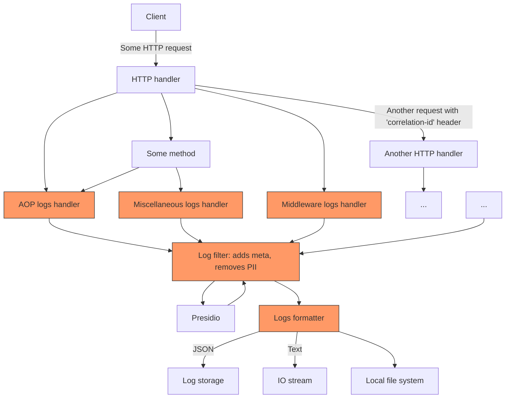

# Z1

## Security design patterns utilized in previous projects
- Arhitecture, Design and Threat modeling -> In web security course project we where given a security requirements. But for some we needed to reasurch on which part of our arhitecture they are applicable. So we thought about how to handle, move and store sensitive data, what kindes of attacks are most likely ...
- Authentication -> Users needed to register and login eather through username + password or through OAuth to our platform to be able to interact with it. We used Java Spring Boot as technology of choice. Paswords were hashed before storing in database. For hasing we used Java PasswordEncoder that uses salt and SHA256 algorithm with some optimizations. And beside login and registration any other action can be taken only by authenticated user. We required pasword swopping every 3 months with a completly new password, recording hashes of previous passwords used.
- Session management -> We use JWT token for "session" management. JWT TTL was valid for 6hours. With every request jwt was send for authentication and autorization. JWT valididity was chacked and requests with tempored tokens were rejected.
- Access Control -> We had role based access control for admins, regular users and CAs.
- Validation, Senitization and Encoding -> We implemented Validation on frontend and on backend to prevent possibility of risking data integration in our database. For encoding we aproached this point in terms of Confidentiality stand point. We implemented https communication between frontend and backend and data was encoded in transit.
- Stored criptography -> For most sensitive data that is not needed in original state we used hashing. SHA 256 with salt. At rest no other principle was used.
- Error Handling and Logging -> Every non GET request was logged in file in parsable format of key-value pairs so "neporecivost" was supported and at any point we could see who and when performed what opperation. TRACE, DEBUG, INFO, WARN, ERROR, FATAL. All enticipated errors where handled on backend returning apropriate HTTP status and description to frontend.
- Data protection -> One aspect of our application was generating and storing user public and private keys. Direct access to static files on our server was disabled and cross-site scriptiong was not possible because we used react as frontend framework. Besides that if attacker gain access to our server he would be able to take all our user keys. We could invalidate all thoese keys, because all of them were issued by our key not stored on the server, but demage was done. 
- Comminication -> HTTPS client-server communication, http from server to db
- File Upload -> We checked uploaded file type and only accepted .crt files. On the backedn files were only parsed not executed or stored. Also users were able to download their own public and private keys and they were served through backedn by sending get request with JWT and id of certificate needed.
- API -> RESTful api 

## 1. Password Hashing

- We choose spring-security as reliable provider and their org.springframework.security.crypto.password.PasswordEncoder; implementation.
- Based on their documentation creating our custom encoder is not recommended and they recommend using one of their known strong implementations.
- Password encoder is a Interface and possible implemnations include: AbstractPasswordEncoder, BCryptPasswordEncoder, NoOpPasswordEncoder, Pbkdf2PasswordEncoder, SCryptPasswordEncoder, StandardPasswordEncoder.
- Default that we choose is  BCryptPasswordEncoder. This class has 2 methods we use encode and matches. We used this algorithm because bcrypt has salts built-in to prevent rainbow table attacks. It uses the bcrypt hashing function.
- This is example of result of doing encode() function $2a$10$2F5uBylnU8CLS2hQxljPp.VkTN3lUoceZjHvyG/j9srr.VpO9ahGy. Even though it looks like one long string it actually contains few segments. $2 specifies version of algorithm used, $10 specifies number of iterations used 2^10 rounds, then it goes a salt and hashed passowrd at the end. If login performance is not important and secirity is focus number one we can incease number of iterations to 2^12 or 2^16, but then it will take about a second to perform passowrd check. Current version 6.2.x, vornabilities patched: [text](https://security.snyk.io/package/maven/org.springframework.security:spring-security-crypto/5.5.3) .
- So secure password needs to be hased with a sault different for each user.

## 2. Auditing Mechanism

Requirements:
1. Log files need to provide debug information to support issue resolution;
2. All events requiring non-repudiation need to be logged, enough information needs to be supplied to prove
non-repudiation, and these events should be easily extracted;
3. Log entries should not store sensitive data;
4. The log mechanism needs to be reliable, ensuring the availability of the mechanism and integrity of the
log files;
5. Log entries across the system need to accurately state the creation time;
6. The log mechanism should strive to minimize cluttering the log files.

Implementation:
1. 
   1. Stack trace need to be included in log records.
   2. Values and context too.
   3. For complicated operation GID (Global ID aka correlation ID) is created and logged with every log record.
   4. Better to use structured logging approach: store logs entries as JSONs.
   5. On the opposite side, logs output to the IO stream should be in the human-readable format and not contain odd information.
2. 
   1. All important events, especially data access and modification, are logged. For simplicity, [AOP](https://www.baeldung.com/spring-aop-annotation) to log every method call can be used.
   2. If system provides the REST API, every request is logged.
   3. Logging enabled in all data storages, correlation id (GID) is passed to the storage.
   4. Logging is enabled in all virtual machines, containers and cloud services.
3. 
   1. Sensitive data is not logged intentionally, instead, hash is preferred.
   2. Log records are checked before logging and sensitive data is replaced with hash-code. E.g. using [Presidio](https://microsoft.github.io/presidio/)
   3. Instead of logging PII, we use user ID and GID.
   4. Log data is being eventually deleted after a certain period of time.
4. 
   1. Log records are stored on the separate server. E.g. [LogStash, ES, Kibana](https://stackoverflow.com/questions/10525725/which-nosql-database-should-i-use-for-logging) or some cloud SaaS solution.
   2. Logs saved in the local file system too, but only as a backup measure.
   2. Any running program in the whole system has only write-access to the logs (both cloud and local).
   3. Replication and backup of the log server is enabled.
   4. Programmers have restricted access to the logs.
5. 
   1. Log records are created with the timestamp. Timestamp is in UTC. Timestamp format is fized, e.g. is in the ISO 8601 format.
   2. When logs are stored in the cloud, the cloud provider's time is stored, e.g. [received time](https://cloud.google.com/logging/docs/reference/v2/rest/v2/LogEntry)
   3. Even though, the system is distributed and the order of event is not guaranteed, for operations that are dependent on the order of events [LogSplit](https://cloud.google.com/logging/docs/reference/v2/rest/v2/LogEntry#LogSplit) approach can be used. (So that instead of writing many entries for one opration, one entry is logged on the different machines).
6. 
   1. Log records are stored in the structured format, so that they can be easily parsed and filtered.
   2. Log records are stored in the cloud, so that they can be easily accessed and analyzed.
   3. Old log records are deleted after a certain period of time.
   4. For local logs record filters by severity and other optimizations can be used.

Example of the whole algorithm:

Log entry example:
```json
{
  "timestamp": "2021-05-01T12:00:00Z",
  "receivedTimestamp": "2021-05-01T12:00:05Z",
  "operation-id": "123e4567-e89b-12d3-a456-426614174000",
  "user-id": "234e5678-e89b-12d3-a456-426614174000",
  "message": "User 234e5678-e89b-12d3-a456-426614174000 called /api/login",
  "severity": "INFO",
  "stacktrace": "..."
}
```

## 3. Additional Security Controls

In this section we are mostly referencing to the "IB-2023" project and "web-security" course project.
The "IB-2023" project is a private repository and access needs to be requested it's located by this [link](https://github.com/Anja0906/IB-2023).
The "web-security" course project is public, and it's located by this [link](https://github.com/tamarailic/websecurity).

### Password Hashing in the "IB-2023" Project

Implementation:
- Auth0 authorizer was used for Auth-N implementation.

Implementation details:
- Auth0 is using [bcrypt JS library](https://www.npmjs.com/package/bcrypt) for password hashing.
  At least [it doesn't have declared vulnerabilities](https://security.snyk.io/package/npm/bcryptjs) by now.
- bcrypt.js is using the bcrypt algorithm to hash passwords with default 10 rounds of hashing.
  So that's the similar algorithm as the one described in the 1.
- Additionally, Auth0 is providing rainbow table attack protection based on their collection of hashes and
  supports password history and expiration.

Comparison:
- Both ideal and actual implementation are using the same algorithm for password hashing.
- The difference is only in the provider of the hashing algorithm.
- <span style="color: red">- using cloud authorization provider means exposing data to the third party service</span>
- <span style="color: green">+ using cloud authorization provider means that the provider is responsible for the security of the hashing algorithm</span>
- <span style="color: green">+ Auth0 provides additional features and more computational power to commit more rounds of hashing, then we can afford while deployment our small project on a free tier of cloud services</span>
- <span style="color: green">+ in case of some vulnerability in the bcrypt algorithm or its implementation, auth0 will fix it faster than we can</span>

### Auditing Mechanism in the "web-security" Project

- Our log files are structured and programatically searchable. Every non GET request was logged with requested action, user id, ip address and timestemp of request. No sesitive content was logged. We log every event with level warning or above in our file on server.
- To implement logging in our application we created our custom AOP Aspect with annotation @WSLogger, so anyone can just extend our functionallity and implement logging in their application just by putting this annotation above their controller endpoint.
- First add dependency for import org.slf4j.Logger; in your project
- This was our aspect code, in short it extracts who made a request and with what parameters and logs taht into file:
```java
@Retention(RetentionPolicy.RUNTIME)
@Target(ElementType.METHOD)
public @interface WSLogger {
}
```
```java
@Aspect
@Component
public class WSLoggerAspect {

    Logger logger = LoggerFactory.getLogger(WSLoggerAspect.class);
    @Autowired
    private JwtTokenUtil jwtTokenUtil;

    @Before("@annotation(WSLogger)")
    public void checkUserIdentity(JoinPoint joinPoint) {
        String action = joinPoint.toShortString().split("\\.")[1].replace("(", "");
        int indexOfData = findIndexOfStringParameter(joinPoint);

        String value = "";
        String parameter = "";
        if (indexOfData != -1) {
            value = (String) joinPoint.getArgs()[indexOfData];
            String[] parameterNames = ((MethodSignature) joinPoint.getSignature()).getParameterNames();
            parameter = parameterNames[indexOfData];
        }

        HttpServletRequest request = ((ServletRequestAttributes) Objects.requireNonNull(RequestContextHolder.getRequestAttributes())).getRequest();
        String authorization = request.getHeader("Authorization");
        if (authorization == null) return;

        String token = authorization.split(" ")[1];
        String username = jwtTokenUtil.getUsernameFromToken(token);

        logger.info(String.format("User %s has executed %s action on %s %s", username, action, value, parameter));

    }

    private int findIndexOfStringParameter(JoinPoint joinPoint) {
        String[] tokens = joinPoint.getSignature().toString().replace(")", "").split("\\(")[1].split(",");
        for (int i = 0; i < tokens.length; i++) {
            if (tokens[i].equals("String")) {
                return i;
            }
        }
        return -1;
    }
}
```
- Some potential improvement we reasurched is to use structured logging database like seq to make our loggs searchable, more on [this link](https://docs.datalust.co/docs/using-java)
