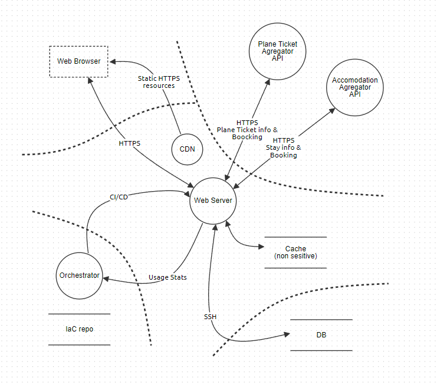
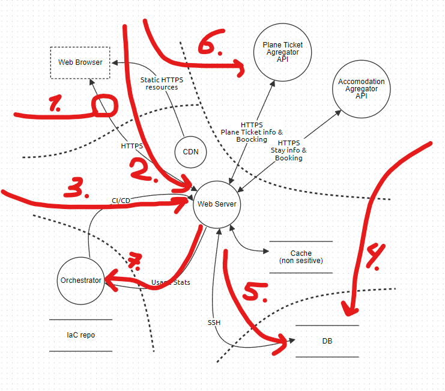

# Z2

## A. Attackers & Motivation

- scammers
- - want to make user pay for their non-existing services

- criminals 
- - want to steal user's PII and sell it

- companies 
- - want to track user's behavior
- - want to weaken their concurrent 
- - avoid paying taxes / fees

- users
- - want to get services for free

## B. Assets

- user's PII
- user's payment information
- user's behavior data
- user's location
- company's turn-over

## C. & D. Attack Surface

1. Client connection with Web Server (mitm)
2. Web Server from the side of client (attack on the API)
3. Web Server via SSH
4. DB from outside
5. DB from server side (in case Server is compromised)
6. Side API services from outside
7. Infrastructure from Server side (in case Server is compromised)

## E. Threat and mitigation analysis

| Surface   | Threat           | Attacker               | Mitigation                                                                                                                               |
|-----------|------------------|------------------------|------------------------------------------------------------------------------------------------------------------------------------------|
| 1.        | STI              | scammers               | HTTPS                                                                                                                                    |
| 2.        | S D E    | scammers               | Reliable headers, OAuth etc.
Fail2ban, Load Balancing etc.
Correct code                                                          |
| 3.        | TID              | criminals              | SSH vulnerabilities mitigation, SSH via VPN tunnel only                                                                                  |
| 4.        | TIDE             | criminals              | SSH vulnerabilities mitigation, SSH in same network only                                                                                 |
| 5.        | I
TD
E   | criminals              | -
Correct WS access rights (non admin)
Delegate Auth-Z to authorizer                                                             |
| 6.        | S
R          | scammers
clients   | Aggregator recognize your service by API key, you recognize API by HTTPS certificate
agree on timely mutual exchange of information  |
| 7.        | ID               | criminals              | Resource usage monitoring                                                                                                                |
|           | R                | clients, companies     | Proper logging of all actions                                                                                                            |
