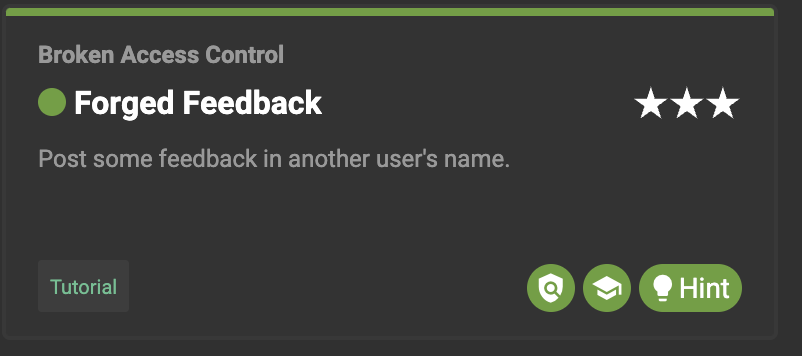

# Setup

## Docker command:
- docker pull bkimminich/juice-shop
- docker run --rm -p 3000:3000 bkimminich/juice-shop

# Challenges finished:

## 1. Login Admin **
### Steps taken:
1. Registration sends HTTP request to `http://localhost:3000/api/Users/`
1. When I try to send a GET request via Postman to the same endpoint I get an Unauthorized response, which means that the endpoint exists, but I just don't have access to it.
1. I registered as a regular user and after a successful login I got a JWT token as a response from the server
1. Now when I send a GET request to `http://localhost:3000/api/Users/` with the provided JWT token I get a response list with all users on the system
1. I can see in plain text users' emails and their roles, so I just copy-pasted the admin's email and guessed the password to be admin123
1. (Alternatively) This can also be done utilising SQL injection and providing admin@juice-sh.op'; as username and any random password
1. I'm in as an admin user
#### Explanation:
1. Injection -> Attacks whereby carefully crafting requests and data given to some specific endpoint hacker can gain access to privileged data and/or disrupt the integrity and possibly the availability of our application
1. Unauthorized use and access to endpoints and data available only to system admins
1. Weak password that can be blindly guessed + SQL Injection that will enable even stronger passwords to be guessed
1. Stronger password requirements in every place where the password can be set or modified front and back + Preventing SQL injection by using the library to perform a required query and not concatenating SQL query manually as strings


## 2. Admin Registration ***
### Steps taken:
1. Registration sends HTTP request to `http://localhost:3000/api/Users/`
1. I copied the body of the request that succeeded to Postman and added the attribute role: "admin" to it
1. This created an admin user successfully, which I can access with the username and password I provided for registration
#### Explanation:
1. Improper Input Validation -> Attack where a hacker can, just by using software like Postman, go around protections and validations set on the on side of the application, but not both
1. Integrity is compromised which can lead to different levels of problems depending on the application type
1. Improper input validation + access to anyone to register new admin to the system
1. Validation on both sides front and back and preventing access to this endpoint to non-super admin user


## 3. Error Handling *
### Steps taken:
1. Looking at the browser network and console tab for errors and endpoints that get triggered by frontend actions
1. Sending different types of requests to given endpoints to check if they exist and how to go around those limitations or sending login requests with ' as email and a random password will give sensitive information in an error response
1. Not properly handled errors that are just propagated from the backend can leak some important information for future exploits
#### Explanation:
1. Security Misconfiguration -> leaving logs from development in production or using bad practice configurations for some security features though to lack of focus or ignorance
1. Accessing information about server organization or other user or architecture-sensitive data can make it easier for an attacker to exploit some other parts of our system + This can damage the confidentiality component of our system
1. Returning the whole error message to the front end and not handling it properly on the backend as a Bad Request
1. Better error handeling


## 4. Password Strength **
### Steps taken:
1. After completing the first part of 1. exploit mentioned my second guess for the password was admin123
1. This happened to be correct do I got in, having a password that is on the list of common passwords and that could be tried with some automation software in very insecure
#### Explanation:
1. Broken Authentication -> Type of attack where an attacker can manually or with some automation break authentication of protected system
1. Confidentiality and Integrity are compromised, the severity of the exploit depends on the privileges of the user
1. Eeak password requirements
1. Stronger password requirements


## 5. Empty User Registration **
### Steps taken:
1. Utilising endpoint fund in exploit 2. I was able to send a POST request to endpoint `http://localhost:3000/api/Users/` with a body that is missing email property and password set to an empty string
```json
{
  "password": "",
  "securityQuestion": {
    "id": 7,
    "question": "Name of your favorite pet?",
    "createdAt": "2024-04-16T14:14:22.982Z",
    "updatedAt": "2024-04-16T14:14:22.982Z"
  },
  "securityAnswer": "misko"
}
```
1. This enabled me to create a user with email set to null and password as an empty string
#### Explanation:
1. Improper Input Validation -> Attack where a hacker can, just by using software like Postman, go around protections and validations set on the on side of the application, but not both
1. Compromising the availability of the system, depending on GET requests and how users are queried while login and other operations can break the system internally
1. Not performing adequate checks at the backend
1. Stronger check on backend for incoming user data


## 6. Repetitive Registration *
### Steps taken:
1. Registering user via Postman and sending a POST request to `http://localhost:3000/api/Users/` endpoint while providing different values for password and repeat password field
#### Explanation:
1. Improper Input Validation -> Attack where a hacker can, just by using software like Postman, go around protections and validations set on the on side of the application, but not both
1. The user does not know what password he/she put in
1. Missing check on the backend side
1. Additional check for password and repeated password matching


## 7. Mass Dispel *
### Steps taken:
1. Using Shift + X to close more than one challenge completed banner
#### Explanation:
1. Miscellaneous


## 8. Christmas Special ****
### Steps taken:
1. If manipulated carefully search box can retrieve all products from the database even if they are currently unavailable
1. Performing this specific GET request through postman ```http://localhost:3000/rest/products/search?q=' )) --``` retrieves all products and with id 10 is Christmas Super-Surprise-Box (2014 Edition) that is not available in any other way
1. Now if we examine what request is sent to add the product to the chart we can try to add this product with id 10 as well, and this is possible with a simple POST request to ```http://localhost:3000/api/BasketItems``` and this body
```json
{"ProductId": 10, "BasketId": "6", "quantity": 1}
```
1. If we now finish the checkout process we can purchase this item that is not available or presented on the website
#### Explanation:
1. SQL Injection -> By precisely manipulating query on some search field we can utilize deficiency on the server side that enables us to perform any query on the database we want
1. This can be used to retrieve sensitive data from our database compromising our confidentiality and enabling other types of attacks
1. Creating SQL query by concatenating strings
1. Using SQL wrapper library


## 9. User Credentials ****
### Steps taken:
1. After figuring out that the search box can be SQL injected and that I can retrieve any database data from this query I started the engineering prompt to retrieve the user password
1. From exploit 3. I knew that table with all the Users was called `Users` so I came up with this query ```http://localhost:3000/rest/products/search?q=qqq' )) UNION SELECT password, id, '3', '4', '5', '6', '7', '8', '9' FROM Users--```
This way I can receive hashed passwords associated with the user's ID and I already know all users with their email and user ID
1. Now that I have the user email and user password in the hashed form I just need to figure out what the original plain text for the password was, luckily Juice Shop does not use salts so, by Googling unhash md5 password I came across this website https://md5.gromweb.com/?md5=0192023a7bbd73250516f069df18b500 which worked perfectly to show me that password was indeed admin123
1. How did I know that the password was MD5 hashed I just asked ChatGPT ;)
#### Explanation:
1. SQL Injection -> By precisely manipulating query on some search field we can utilize deficiency on the server side that enables us to perform any query on the database we want
1. Confidentiality and Integrity are compromised but this is a very big exploit that can destroy our web app
1. Giving attacker access to hashed passwords (that are also not that strongly hashed, not using best practices) without even him needing to have access to the server
1. Preventing SQL Injection and use of better hashing practices


## 10 CAPTCHA Bypass ***
### Steps taken:
1. Observing what request is sent when Customer feedback is submitted on page `http://localhost:3000/#/contact` helped me figure out that I need to send a POST request to endpoint `http://localhost:3000/api/Feedbacks/` with a body like this:
```json
{
  "UserId": 22,
  "captcha": "id",
  "captcha": "answare",
  "comment": "Great Service (***s.pocek@gmail.com)",
  "rating": 5
}
```
where id should be the current captcha ID and the captcha attribute should be aware of the math captcha provided
1. To solve this problem I created a Python script that can send an appropriate GET request to retrieve captcha data `response = requests. get('http://localhost:3000/rest/captcha/')` and just insert the appropriate data in the request mentioned above
1. The script that is used to solve this challenge can be found in ./Scripts/captcha_bypass.py in this Z3 folder
#### Explanation:
1. Broken Anti Automation -> Captch was put in place to prevent robots from getting access to the platform, but misconfiguration in some other settings and insecure data sent to frontend enabled attackers to bypass this protection
1. DOS and Spam attacks which can damage UX and potentially even compromise our web app availability
1. Bad implementation of the CAPTCHA mechanism
1. Different CAPTCHA implementation
1. Preventing SQL Injection and use of better hashing practices


## 11. Admin Section **
### Steps taken:
1. Finiding all website paths, even thoese without direct hyperlink leading to them showed me this path `/administration`
1. After I was able to login, going to this route was enabled
1. Because admin panel is hosted as the same app as the user facing app, gaining access to unothorised user role enables attacker access paths of webiste that are protected
#### Explanation:
1. Broken Access Control -> Performing action that should not be permited to specific user  or user role
1. Can delete other users and make inapropriate actions to customers which can demage website reputation
1. Week access cnotrol limits
1. Devide admin panel into separate app that is not available on the interent


## 12. Forged Feedback ***
### Steps taken:
1. While conducting exploit 10. I tried to send request with different userId which was sucessfull
#### Explanation:
1. Broken Access Control -> Performing action that should not be permited to specific user  or user role
1. Impersination and making spam content in other customers name
1. Lack of check on how can perform what opperation
1. Checking JWT of the user who submited the request to validate is he trying to perform action for themselves or for some other user which should not be allowed



## 13. Easter Egg ****

### Steps taken:
1. `localhost:3000/ftp` serves static files, and in the root directory we can see the egg itself
    However, ftp server is configured to allow only `.md` and `.pdf` files
2. We can falsify the extension of the file to `.pdf` by adding null prefix consisting of a null byte and `.pdf` in the end of the file: `eastere.gg%00.pdf`
3. To pass a new path as URL we need to url-encode `%` as `%25` so the final URL is `ftp://localhost:3000/ftp/eastere.gg%2500.pdf` 

#### Explanation:
1. Security Misconfiguration while leaving some files that should not be available to the public
2. <i>Poison Null Byte attack</i> - file system works with the string only before the null byte,
   while the PHP validates the whole string.
3. Can disclosure sensitive information if it is stored in the `/ftp` dir.
4. Don't leave sensitive files in the public directory.
5. Avoid poison null byte, e.g. like here `$file = str_replace(chr(0), '', $string);`


## 14. Deluxe Fraud ***

### Steps taken:
1. Install the Burp Suite and configure it to intercept the traffic
2. Log in as user with id 3 (he has empty wallet)
3. Try to buy a deluxe membership using wallet
4. For this reason, slightly change HTML to enable button submit
5. Intercept the request and change the payment method to `""`

#### Explanation:
1. Due to some bug in validation - purchase is not validated if payment method is unknown.
2. Leads to a situation where user can buy a product without paying for it.
3. Tests and keeping code simpler should help. 


## 15. Unsigned JWT *****

1. Log in for anyone
2. With EditThisCookie get the `token` cookie
3. On https://token.dev/ encoded it
4. Changed the `email` and `alg` to `none`
5. Encoded to base64url using https://base64.guru/standards/base64url/encode
6. Replace the `token` cookie with the new one

```
ew0KICAidHlwIjogIkpXVCIsDQogICJhbGciOiAibm9uZSINCn0.ew0KICAic3RhdHVzIjogInN1Y2Nlc3MiLA0KICAiZGF0YSI6IHsNCiAgICAiaWQiOiAzLA0KICAgICJ1c2VybmFtZSI6ICIiLA0KICAgICJlbWFpbCI6ICJqd3RuM2RAanVpY2Utc2gub3AiLA0KICAgICJwYXNzd29yZCI6ICIwYzM2ZTUxN2UzZmE5NWFhYmYxYmJmZmM2NzQ0YTRlZiIsDQogICAgInJvbGUiOiAiZGVsdXhlIiwNCiAgICAiZGVsdXhlVG9rZW4iOiAiMDVkMGZiZDVjNzRhNmFlY2Y3MzgxOWQ5NTU5ZTg3NjZlODRiNzMxNjcwMjc0ZTU4OGI0ZThkOWZmMTIzN2UwZSIsDQogICAgImxhc3RMb2dpbklwIjogIiIsDQogICAgInByb2ZpbGVJbWFnZSI6ICJhc3NldHMvcHVibGljL2ltYWdlcy91cGxvYWRzL2RlZmF1bHQuc3ZnIiwNCiAgICAidG90cFNlY3JldCI6ICIiLA0KICAgICJpc0FjdGl2ZSI6IHRydWUsDQogICAgImNyZWF0ZWRBdCI6ICIyMDI0LTA0LTE4VDE4OjE3OjI2LjE1MVoiLA0KICAgICJ1cGRhdGVkQXQiOiAiMjAyNC0wNC0xOFQxOTowODo1MC43NjVaIiwNCiAgICAiZGVsZXRlZEF0IjogbnVsbA0KICB9LA0KICAiaWF0IjogMTcxMzQ2NzMzMQ0KfQ
```

#### Explanation:
1. JWT is not signed, so it can be easily manipulated.
2. Just a poor configuration of the Auth-N requirements.
3. Any kind of fraud can be done.
4. Just force JWT to be signed.


## 16. Bjoern's Favorite Pet ***

1. Using SQL injection I learned Bjorn's email `bjoern@owasp.org`
2. restore password
3. Pet name question - just googled `Bjorns pet`: https://twitter.com/bkimminich/status/1594985736650035202

#### Explanation:
1. Special questions are not very reliable mechanism, especially for the public figures as Bjorn.
2. Better to use it together with another 2FA mechanism.
3. And to ask some less public information. Maybe some personal question.


## 17. Extra Language *****

`tlh_AA` - Klingon
1. Tried to brute force the language code, but it was not successful, cause Klingon code is not xx_XX :(
2. Just googled it.

#### Explanation:
1. Some WIP files are in the prod - that's bad.
2. But very this vulnerability is not very dangerous.


## 18. Login Bender ***

1. Accidentally solved it while searching for Bjorn's email.
2. Just used `a' OR id=3 --` injection
3. Only detail is that injection in the password field is not possible, since it is hashed.

#### Explanation:
1. SQL injection is a very dangerous vulnerability.
2. Just use prepared statements or ORM.


