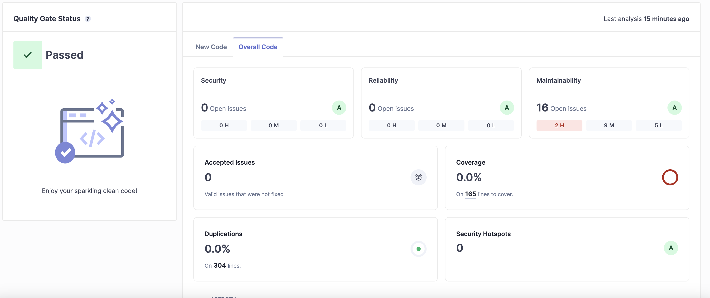
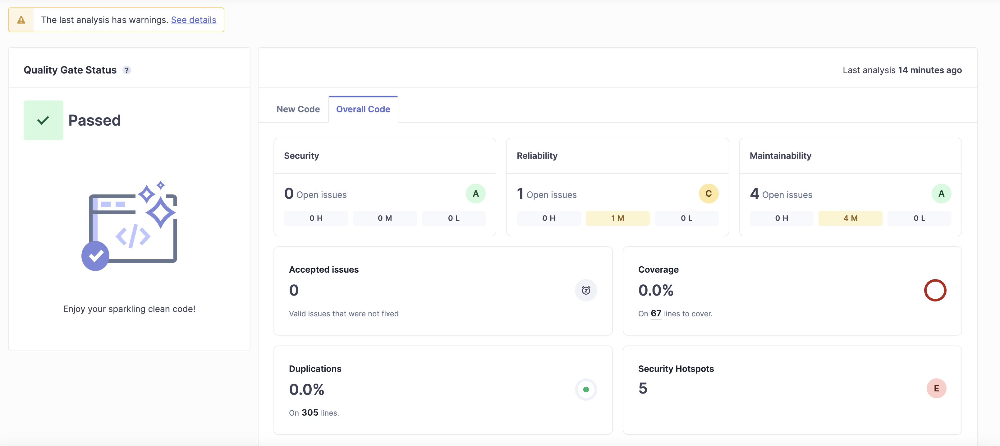

# Z4

## Uros - StudentVentures

### Project description:
- Web platform that aims to connect students from different universities and knowledge domains to work together and bring their ideas into reality. 
- Part of the project that will be reviewed focuses on student registration, verification, and competing on the leaderboard. To register students need to populate basic personal information and verify accounts based on the link that is sent via email. Students compete on the leaderboard by sharing their unique link and inviting other students to join the platform, that way they gain points and increase their chances of winning prizes.
### Team:
- Uroš Poček
- Tamara Ilić
### Defects Found:
- To analyze code for this project we performed static code analysis where each person reviewed another person's code
- In my code, Tamara found a missing check if the user with the provided email already exits, so I added the code provided below
```python
 handle = generate_handle(newUser['email'])
 response = subscribersTable.get_item(Key={'id': handle})
 if 'Item' in response:
 return create_response(400, {'error': 'User already exists'})
```
- I found an error in her logic where she awarded points to every person higher in the affiliate chain, which will prevent users that are on the second or lower level of the hierarchy from ever having more points than once above them, she fixed the bug removing recursion and this is here final code:
```python
def give_points_to_referrer_chain(referrer):
 if referrer == 'empty':
 return
 response = subscribers_table.get_item(Key={'id': referrer})
 if 'Item' in response:
 item = response['Item']
 item['points'] += 10 # type: ignore
 subscribers_table.put_item(Item=item)
```
### Summary of the Recommendation
- After we completed manual static code analyses we set up SonarQube and performed analyses with it. These were the results:

- We had 16 issues mostly with regards to naming conventions, formatting, and exception handling. The biggest issues were:
- - Add replacement fields or use a normal string instead of an f-string. 
- - Specify an exception class to catch or reraise the exception

### Review Time and Defects Found:
- Manual review took about 1 hour (we were reviewing each other's code in parallel) and we found 2-3 smaller issues that I didn't mention and one bug in code logic which will be hard to find with any automated tool.
- Setting up and researching sonar for this project took us about 1.5 hours, but we were able to make it run in Docker and perform code review for any project locally

## Tamara - PerfectConditions-IoT

### Project description:
- University project for IoT subject. We created a complete end-to-end solution to monitor plant conditions and give owner suggestions. We have C++ code for ESP that talks to sensors to gather different readings we then send those readings through RaspberryPi to our server written in Rust to analyze them and give owner suggestions on how to make better conditions for his/her plant through a mobile app written in Flutter.
### Team:
- Tamara Ilić
- Uroš Poček
### Defects Found:
- To analyze code for this project, we performed static code analysis where each person reviewed another person's code.
- In Uroš's code, I found leaked token and database configuration settings. 
- I fixed this part of the code to use variables from a secret .env file instead
```rust
fn get_influxdb_client() -> Client {
 dotenv().ok();
 let host = env::var("INFLUXDB_HOST").expect("INFLUXDB_HOST must be set");
 let org = env::var("INFLUXDB_ORG").expect("INFLUXDB_ORG must be set");
 let token = env::var("INFLUXDB_TOKEN").expect("INFLUXDB_TOKEN must be set");
 let client = Client::new(host, org, token);
 client
}
```
- In my code, he found an error in logic on the mobile app where I forgot to close the web socket connection after navigating from one page to another which led to more resources used than necessary, but I fixed that after a review
```dart
@override
 void dispose() {
 _channel. sink.close();
 _controller.dispose();
 super.dispose();
 }
```
### Summary of the Recommendation
- After we completed manual static code analyses used SonarQube and performed analyses with it. These were the results:

- We had 5 issues mostly about Maintainability
- one reliability issue
- - Add "lang" and/or "xml:lang" attributes to this "<html>" element
- and 5 security hotspots still present
- - we fixed those based on sonar recommendations

### Review Time and Defects Found:
- Manual review took about 30 minutes (we were reviewing each other's code in parallel) and we found a few smaller issues that I didn't mention and some bigger bugs that I wrote about
- As the Sonar was already set I just ran it with this project and got the mentioned results

## Alex

### ████ - Credit agreement analysis tool

1. That's a real life project from Upwork. It is based on the startup idea of █████████, an american business student.
    
    In a few words, the idea is to convert standard credit agreements into Excel tables using ChatGPT. 
    Since clients are providing personal data as credit agreements - code need to be secure and reliable.

    On the other hand this work was made very fast and just for 15$/hr
    (what is very cheap price for a work with screen recorder, I would say). So the quality of code should be low.
    Let's find bugs! 
2. █████████ - founder and r&d. Aleksandr Mishutkin - developer.
3. Defects found by **Bandit** tool: 
    
    | Issue                                                                                                    | Severity | Confidence | CWE     | Location                                                 | Code Example                                                                  | Solution                                                |
    |----------------------------------------------------------------------------------------------------------|----------|------------|---------|----------------------------------------------------------|-------------------------------------------------------------------------------|---------------------------------------------------------|
    | [B311:blacklist] Standard pseudo-random generators are not suitable for security/cryptographic purposes. | Low      | High       | CWE-330 | [auth_views.py:37:56](.\ParsingAPI\auth_views.py:37:56)  | `user.username = request.POST['email'] + str(random.randint(100000, 999999))` | Use a cryptographically secure random number generator. |
    | [B311:blacklist] Standard pseudo-random generators are not suitable for security/cryptographic purposes. | Low      | High       | CWE-330 | [auth_views.py:39:24](.\ParsingAPI\auth_views.py:39:24)  | `safe_code = random.randint(100000, 999999)`                                  | Use a cryptographically secure random number generator. |
    | [B311:blacklist] Standard pseudo-random generators are not suitable for security/cryptographic purposes. | Low      | High       | CWE-330 | [auth_views.py:41:28](.\ParsingAPI\auth_views.py:41:28)  | `safe_code = random.randint(100000, 999999)`                                  | Use a cryptographically secure random number generator. |
    | [B113:request_without_timeout] Requests call without timeout                                             | Medium   | Low        | CWE-400 | [email_service.py:29:15](.\Utils\email_service.py:29:15) | `response = requests.post(url, headers=headers, data=json.dumps(payload))`    | Set a timeout value for the requests call.              |
    | [B113:request_without_timeout] Requests call without timeout                                             | Medium   | Low        | CWE-400 | [email_service.py:74:15](.\Utils\email_service.py:74:15) | `response = requests.post(url, headers=headers, data=json.dumps(payload))`    | Set a timeout value for the requests call.              |

    My own concerns:
    1. I haven't left password and API keys in the code, but some non-critical credentials are still present:
       1. Sendgrid email
       2. Allowed hosts
       3. DB host!!! in `settings.py`
       4. My and █████████'s email in the `email_service.py` (we were in a cc for all messages)
    
       All this values could be moved to envs.
   2. The files are saved to S3, but they are also stored on disc.
      The files' size is not controlled, so DDOS attack can easily use all the memory.
   3. Django default password security settings
   4. Email validation code have no timeout
5. Advises:
   1. Don't outstaff work with sensitive finances to the Upwork
   2. More credentials to the ENV variables (use CI/CD, instead of manual deployment)
   3. More advanced password policies
   4. More advanced 2FA policies
   5. Or use SaaS authorizer instead
   6. Use `Tempfile` or other library to manage file upload
   7. `Fail2ban`. The problem is not fully described here, but it's really needed, trust me
   8. Make corporate emails for developers, and use them from ENVs
6. 40 minutes (including Bandit installation and logging in to my Upwork account).
   But project is not big, and I'm familiar with it
