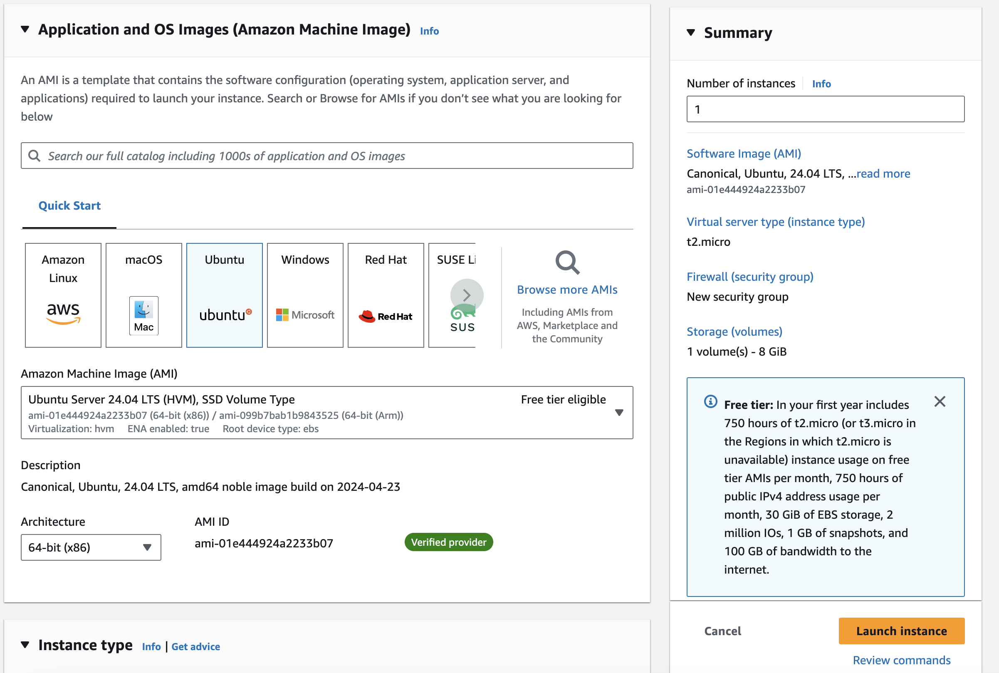
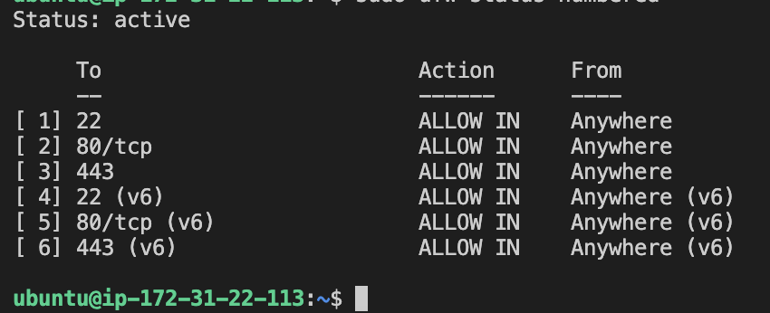
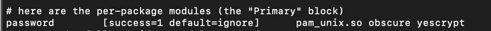

# Z5

## Uros
### Set up
- Created an AWS EC2 Instance using Debian 11 (Bullseye) AMI, SSD Volume Type on t2.micro with 1CPU core and 1GB RAM.
- Set up SSH connection with .pem key, DNS of the virtual machine is ec2-3-120-45-67.eu-central-1.compute.amazonaws.com.
- To connect, use this command:
`ssh -i "debian_key.pem" admin@ec2-3-120-45-67.eu-central-1.compute.amazonaws.com`
- Upon successful connection, you will see a welcome message similar to the one below:
```
Welcome to Debian GNU/Linux 11 (bullseye)!

 * Documentation:  https://www.debian.org/doc/
 * Support:        https://www.debian.org/support

System information as of Sun May 19 21:21:54 UTC 2024

  System load:  0.0               Processes:             100
  Usage of /:   25.4% of 8.00GB   Users logged in:       1
  Memory usage: 18%               IPv4 address for eth0: 172.31.24.56
  Swap usage:   0%

The programs included with the Debian GNU/Linux system are free software;
the exact distribution terms for each program are described in the
individual files in /usr/share/doc/*/copyright.

Debian comes with ABSOLUTELY NO WARRANTY, to the extent permitted by
applicable law.
Security
Set up the firewall with ufw to allow SSH and HTTP/HTTPS connections to the server:
```

`sudo ufw allow OpenSSH`
`sudo ufw allow http`
`sudo ufw allow https`
`sudo ufw enable`
`sudo ufw status`

### Analytics
Perform standard analytics to check server version, uptime, timezone, etc.:
`lsb_release -a`
`uptime`
`timedatectl`

- View all installed packages:
`dpkg -l | less`

- Secure access to all sensitive files by setting appropriate permissions:
`sudo chmod -R go-rwx /path/to/sensitive/files`

### Passwords
- For password hashing, ensure yescrypt is set up, which is a strong and modern algorithm for systems in 2024. To verify or set up yescrypt, you might need to modify the PAM (Pluggable Authentication Modules) configuration:
`sudo nano /etc/pam.d/common-password`

- Ensure the line includes yescrypt:
`password [success=1 default=ignore] pam_unix.so obscure use_authtok try_first_pass yescrypt`

- List running processes:
`ps -edf`

### Extra info
Check all default cron jobs for the user:
`crontab -u <user> -l`


## Tamara
### Set up
- Created AWS EC2 Instance, Ubuntu Server 24.04 LTS (HVM), SSD Volume Type on t2.micro with 1CPU core and 1GB RAM

- Then I setuped shh connection with .pem key, DNS of my virtual machine is ec2-35-159-25-183.eu-central-1.compute.amazonaws.com
- To connect I use this command ssh -i "rbs_up.pem" ubuntu@ec2-35-159-25-183.eu-central-1.compute.amazonaws.com
```
Welcome to Ubuntu 24.04 LTS (GNU/Linux 6.8.0-1008-aws x86_64)

 * Documentation:  https://help.ubuntu.com
 * Management:     https://landscape.canonical.com
 * Support:        https://ubuntu.com/pro

 System information as of Sun May 19 21:21:54 UTC 2024

  System load:  0.0               Processes:             105
  Usage of /:   23.1% of 6.71GB   Users logged in:       0
  Memory usage: 19%               IPv4 address for enX0: 172.31.22.113
  Swap usage:   0%

 * Ubuntu Pro delivers the most comprehensive open source security and
   compliance features.

   https://ubuntu.com/aws/pro

Expanded Security Maintenance for Applications is not enabled.

0 updates can be applied immediately.

Enable ESM Apps to receive additional future security updates.
See https://ubuntu.com/esm or run: sudo pro status


The list of available updates is more than a week old.
To check for new updates run: sudo apt update


The programs included with the Ubuntu system are free software;
the exact distribution terms for each program are described in the
individual files in /usr/share/doc/*/copyright.

Ubuntu comes with ABSOLUTELY NO WARRANTY, to the extent permitted by
applicable law.

To run a command as administrator (user "root"), use "sudo <command>".
See "man sudo_root" for details.
```

### Security
- Then I setuped firewall with `ufw` to allow ssh and http/https connections to my server


### Analytics
- Now I performed standard analytics, checking server version, uptime, timezone etc.
- See all packages installed with `dpkg -l | less`
- After that I secured access to all sensitive files

### Passwords
- On server for password hasing `yescrypt` has been setup which is strong and modern algorithm for systems in 2024.
- Running command `ps -edf` showed me list of running processes on the server

### Extra info
- Checked all defualt cron jobs with `crontab -u <user> -l`



## Alex

### Set up
<ol>

<li>
Starting Docker `Ubuntu-24` image.
Privileged because we need to edit network settings.
Volume is for saving logs right as we go (path - Windows stuf).

```bat
docker run -it --privileged -v "//d/source/repos/docs/SecureSoftwareDevelopment/Z5/alex/tmp_from_docker:/tmp" -p 5000:5000 -p 22:22 ubuntu:24.04
```
</li>
<li>
I've tried to use `screen`, but it's <span style="color: red;">awful!!!</span>
There were options to use `tmux-logging`, but in fact Docker saves logs, so... no need to suffer.

```bat
docker logs -f suspicious_knuth *> Z5/alex/docker.log
```
</li>

<li>
Installing `open-ssh`

```shell
apt install openssh-server
```

Oopps, no such package.

```shell
apt update
```

</li>

<li>
Installing `nano`.
</li>

<li>
Installing `Python3`. (it is already here)

But we still need to install `pip`.

```shell
apt install python3-pip -y
```
</li>

<li>

```shell
apt install python3-flask
```

Creating some example app (see tmp for details) and running it:

```shell
python3 -m flask --app example run --host=0.0.0.0 &
```

(For those who like me can not start it right from a first try:)

```shell
kill $(lsof -t -i:5000)
```

Installing `lsof` first.
</li>

<li>

```shell
passwd
```

`starcraftrules`

</li>

</ol>

### OS review

<ol>

<li>

``` 
root@9509f6362468:/tmp#  lsb_release -a

No LSB modules are available.
Distributor ID: Ubuntu
Description:    Ubuntu 24.04 LTS
Release:        24.04
Codename:       noble
```

</li>
<li>

``` 
root@9509f6362468:/tmp# uname -a

Linux 9509f6362468 5.15.49-linuxkit-pr #1 SMP Thu May 25 07:17:40 UTC 2023 x86_64 x86_64 x86_64 GNU/Linux
```

</li>
<li>

```
root@9509f6362468:/tmp# uptime

 23:24:54 up  7:08,  0 user,  load average: 0.00, 0.00, 0.00
```

</li>

</ol>

### Time review

<ol>

<li>

```
root@9509f6362468:/tmp# cat /etc/timezone 
Europe/Belgrade
```

</li>

</ol>

### Package review

1. ```apt list --manual-installed```

Lots of output but nothing interesting (image is new)

### Logging

Discussed in the beginning - Docker cares about it)

### Network review

<ol>
<li>
Installed `ufw`. Configure it to allow `5000` and `22`.

```
root@9509f6362468:/tmp# ufw status
Status: active

To                         Action      From
--                         ------      ----
5000                       ALLOW       Anywhere
22/tcp                     ALLOW       Anywhere
5000 (v6)                  ALLOW       Anywhere (v6)
22/tcp (v6)                ALLOW       Anywhere (v6)
```
</li>

<li>
`ufw` works on reboot:

```
root@9509f6362468:/tmp# ufw enable
Firewall is active and enabled on system startup
```
</li>
</ol>

### Files review

<ol>
<li>
I know that there is only `/tmp` mounted, so I will not check other million of Docker-mounted services for this work.
In real world they all should be checked.

```
root@9509f6362468:/tmp# mount | grep /tmp

grpcfuse on /tmp type fuse.grpcfuse (rw,nosuid,nodev,relatime,user_id=0,group_id=0,allow_other,max_read=1048576)
```
I want to make it `noexec`
```
root@9509f6362468:/tmp# mount -o remount,noexec /tmp
```

```
root@9509f6362468:/tmp# mount | grep /tmp
grpcfuse on /tmp type fuse.grpcfuse (rw,nosuid,nodev,noexec,relatime,user_id=0,group_id=0,allow_other,max_read=1048576)
```

</li>
<li>

```
root@9509f6362468:/tmp# ls -al /etc/shadow

-rw-r----- 1 root shadow 712 May 15 22:13 /etc/shadow
```

Enough secure.

</li>

<li>

Kinda ok. Docker and ubuntu stuf.

```
root@9509f6362468:/tmp# find / -perm -4000 -ls

  3014913     36 -rwsr-xr--   1 root     messagebus    34960 Apr  8 16:38 /usr/lib/dbus-1.0/dbus-daemon-launch-helper
  2886665    336 -rwsr-xr-x   1 root     root         342632 Apr  5 21:30 /usr/lib/openssh/ssh-keysign
  1708708     64 -rwsr-xr-x   1 root     root          64152 Apr  9 09:01 /usr/bin/passwd
  1708800     40 -rwsr-xr-x   1 root     root          39296 Apr  9 16:02 /usr/bin/umount
  1708774     56 -rwsr-xr-x   1 root     root          55680 Apr  9 16:02 /usr/bin/su
  1708697     40 -rwsr-xr-x   1 root     root          40664 Apr  9 09:01 /usr/bin/newgrp
  1708633     76 -rwsr-xr-x   1 root     root          76248 Apr  9 09:01 /usr/bin/gpasswd
  1708566     72 -rwsr-xr-x   1 root     root          72792 Apr  9 09:01 /usr/bin/chfn
  1708572     44 -rwsr-xr-x   1 root     root          44760 Apr  9 09:01 /usr/bin/chsh
  1708692     52 -rwsr-xr-x   1 root     root          51584 Apr  9 16:02 /usr/bin/mount
```
</li>

</ol>

### Users' review

1. `cat /etc/passwd`: all ids are not 0, except for a root. Ok.

<li>

```
root@9509f6362468:/tmp# cat  /etc/shadow
root:$y$j9T$AoYtKnzDmoGgsGr3ZabP1/$7PsDNKNajgry8gcyAIAf.FaK.WF7S8YzUs6e3vbKhr0:19858:0:99999:7:::
```

As we see, it starts with `$y$`, what means `yescrypt` algorithm (a slightly more crack resistant version of `SHA-512`)

</li>

<li>

Let's try to crack it!

```shell
apt-get install john -y
john --wordlist=rockyou.txt hash.txt --format=crypt
```

```
root@9509f6362468:/tmp# john --show hash.txt
?:starcraftrules

1 password hash cracked, 0 left
```

Not reliable, so

</li>


### Review sudoers

```shell
root@9509f6362468:/tmp# grep -Po '^sudo.+:\K.*$' /etc/group

ubuntu
```

That's pretty bad, I guess. In production, we don't need default user at all, especially with sodo rights.

### Review services

At least services are ok))

```
root@9509f6362468:/tmp# ps -edf

UID        PID  PPID  C STIME TTY          TIME CMD
root         1     0  0 05:04 pts/0    00:00:00 /bin/bash
root      4000     0  0 06:14 pts/1    00:00:00 /bin/sh
root      5929     1  0 06:47 pts/0    00:00:05 python3 -m flask --app example run --host=0.0.0.0
root      6691     1  0 16:45 pts/0    00:00:00 ps -edf
```

### Review openssh

1. It's accessible
2. Can not log in as root
3. Go to sshd_config: changed `AllowTcpForwarding`, added `protocol 2`, but keep default root login policy (cause I think non-pwd-login for a root is still ok)
4. Created `authorized_keys` and added my key
5. Works


